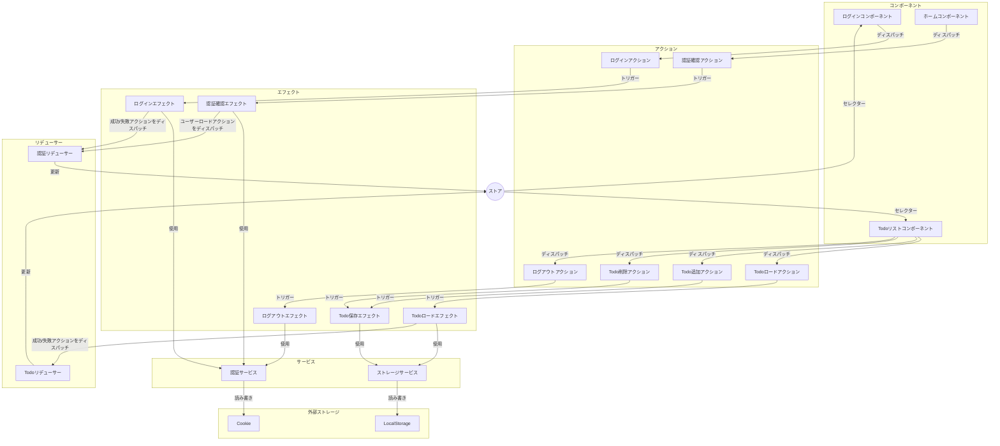
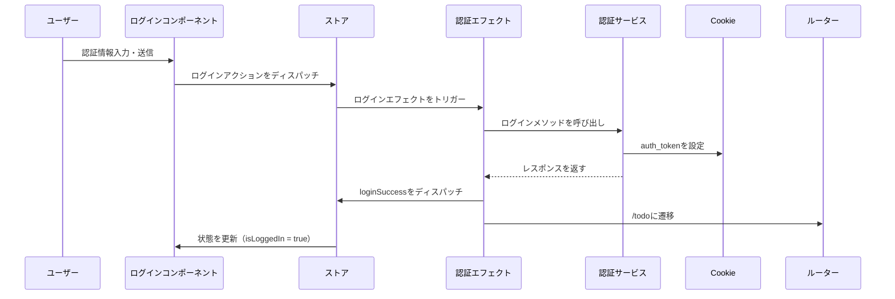
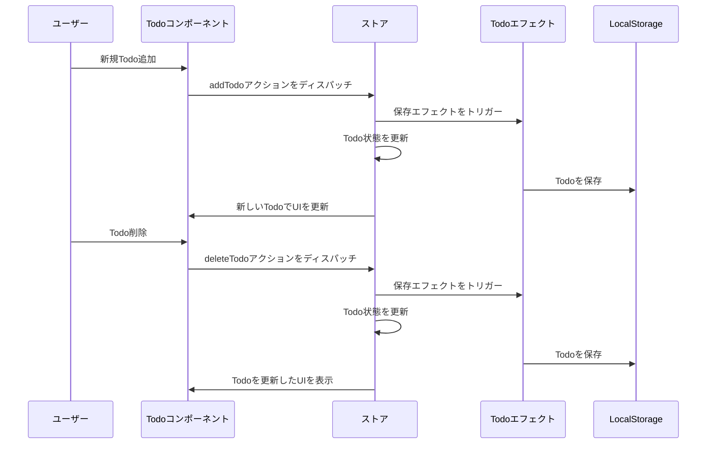
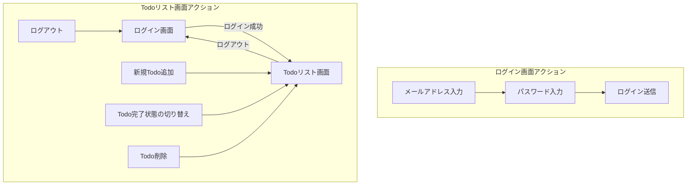

# Angular NgRxサンプル学習プロジェクト

このプロジェクトは[Angular CLI](https://github.com/angular/angular-cli) バージョン19.2.10を使用して生成されました。

## NgRxを使用した状態管理

このアプリケーションは状態管理にNgRxを使用し、以下の機能を備えています：

### 認証状態
- **トークン保存**: 認証トークンはCookieに保存されます
- **ログイン/ログアウト**: NgRxのアクションとエフェクトで管理されます
- **ルート保護**: Todoルートは有効なトークンをチェックする認証ガードで保護されています

### Todo状態
- **ローカルストレージ**: TodoはブラウザのlocalStorageに保存されます
- **CRUD操作**: 追加と削除操作はNgRxで実装されています

## NgRxストア構造
```
store/
├── auth/
│   ├── auth.actions.ts    # 認証関連のアクション
│   ├── auth.effects.ts    # 認証の副作用（API呼び出し、Cookie保存）
│   ├── auth.reducer.ts    # 認証状態のリデューサー
│   └── auth.selectors.ts  # 認証状態のセレクター
└── todo/
    ├── todo.actions.ts    # Todo関連のアクション
    ├── todo.effects.ts    # Todoの副作用（localStorage）
    ├── todo.reducer.ts    # Todo状態のリデューサー
    └── todo.selectors.ts  # Todo状態のセレクター
```

## NgRxデータフロー図



## 認証フロー



## Todo操作フロー



## NgRxコアファイルの説明

### 認証状態管理

#### `auth.actions.ts`
認証操作のアクションクリエーターを含みます：
- `login`: ユーザーが認証情報を送信するときにディスパッチされます
- `loginSuccess`: ログインが成功したときにディスパッチされ、トークンを含みます
- `loginFailure`: ログインが失敗したときにディスパッチされ、エラーを含みます
- `loadUser`: ユーザープロファイルデータを読み込むためにディスパッチされます
- `logout`: 現在のセッションを終了するためにディスパッチされます
- `checkAuth`: ユーザーが認証されているかを確認するためにディスパッチされます（アプリ初期化時）

#### `auth.effects.ts`
認証アクションの副作用を処理します：
- AuthServiceを使用してログインリクエストを処理します
- Cookieに認証トークンを保存/取得します
- ログイン/ログアウト後のナビゲーションを処理します
- 認証が成功したときにユーザーデータを読み込みます
- アプリ初期化時に認証状態を確認します

#### `auth.reducer.ts`
認証状態の更新を管理します：
- ユーザー情報を追跡します
- 認証トークンを保存します
- ローディングとエラー状態を管理します
- ログアウト時に状態をリセットします

#### `auth.selectors.ts`
認証状態のための最適化されたセレクターを提供します：
- `selectUser`: 現在のユーザーを取得します
- `selectIsLoggedIn`: ユーザーが認証されているかを判断します
- `selectAuthLoading`: ローディング状態を追跡します
- `selectAuthError`: 認証エラーを提供します

### Todo状態管理

#### `todo.actions.ts`
Todo操作のアクションを定義します：
- `loadTodos`: localStorageからTodoを読み込むためにディスパッチされます
- `addTodo`: 新しいTodoを追加するときにディスパッチされます
- `toggleTodo`: Todoを完了/未完了としてマークするときにディスパッチされます
- `deleteTodo`: Todoを削除するときにディスパッチされます

#### `todo.effects.ts`
Todoの永続化と副作用を管理します：
- アプリ初期化時にlocalStorageからTodoを読み込みます
- 変更が発生したときにlocalStorageにTodoを保存します
- Todo操作のエラー状態を処理します

#### `todo.reducer.ts`
アクションに基づいてTodo状態を更新します：
- Todo配列を管理します
- ローディングとエラー状態を処理します
- TodoアイテムのCRUD操作を処理します

#### `todo.selectors.ts`
Todo状態へのアクセスのためのセレクターを提供します：
- `selectTodos`: すべてのTodoのリストを取得します
- `selectTodoById`: IDによる特定のTodoを取得します
- `selectTodoLoading`: Todo操作のローディング状態を追跡します

## ガードとコンポーネント

### `auth.guard.ts`
認証を必要とするルートを保護します：
- Cookieに有効な認証トークンがあるかをチェックします
- 認証されていない場合、ログインページにリダイレクトします
- 認証されている場合、ユーザーデータを読み込みます

### 主要コンポーネント

#### `HomeComponent`
リダイレクトロジックを処理するエントリーポイント：
- 認証トークンの存在を確認します
- 認証状態に基づいて適切な画面にリダイレクトします

#### `LoginComponent`
ユーザー認証を処理します：
- ユーザー認証情報を収集します
- ログインアクションをディスパッチします
- ローディングとエラー状態を表示します
- ログイン成功時にリダイレクトします

#### `TodoListComponent`
Todo操作を管理します：
- Todoのリストを表示します
- Todo追加/切り替え/削除を処理します
- ログアウト機能によりユーザーセッションを管理します

## 画面フロー図



## 画面説明

### ログイン画面
- **メールアドレス入力**: ユーザーメールアドレスの入力フィールド
- **パスワード入力**: ユーザーパスワードの入力フィールド
- **ログイン送信**: ユーザー認証情報を認証するボタン

### Todoリスト画面
- **新規Todo追加**: 新しいTodoアイテムを作成するための入力フィールドとボタン
- **Todo完了状態の切り替え**: Todoを完了または未完了としてマークするチェックボックス
- **Todo削除**: リストからTodoを削除するボタン
- **ログアウト**: 現在のセッションを終了してログイン画面に戻るボタン

## 開発コンテナ

このプロジェクトにはVisual Studio Code用のdevcontainer設定が含まれています。devcontainerは以下を備えた一貫した開発環境を提供します：

- Node.js 20
- Angular CLIがプリインストール済み
- 開発サーバー用にポート4200が転送済み
- ルートユーザーアクセス

devcontainerを使用するには：
1. VS Codeに[Remote - Containers](https://marketplace.visualstudio.com/items?itemName=ms-vscode-remote.remote-containers)拡張機能をインストールします
2. VS Codeでプロジェクトを開きます
3. 左下の緑色のボタンをクリックして「コンテナで再度開く」を選択します

## 開発サーバー

ローカル開発サーバーを起動するには、以下を実行します：

```bash
ng serve
```

サーバーが起動したら、ブラウザで`http://localhost:4200/`にアクセスしてください。ソースファイルを変更すると、アプリケーションは自動的に再読み込みされます。

## コードスキャフォールディング

Angular CLIには強力なコードスキャフォールディングツールが含まれています。新しいコンポーネントを生成するには：

```bash
ng generate component コンポーネント名
```

利用可能なスキーマティック（`components`、`directives`、`pipes`など）の完全なリストを表示するには：

```bash
ng generate --help
```

## ビルド

プロジェクトをビルドするには：

```bash
ng build
```

これによりプロジェクトがコンパイルされ、ビルド成果物が`dist/`ディレクトリに保存されます。デフォルトでは、本番ビルドはパフォーマンスと速度のためにアプリケーションを最適化します。

## ユニットテストの実行

[Karma](https://karma-runner.github.io)テストランナーでユニットテストを実行するには：

```bash
ng test
```

## エンドツーエンドテストの実行

エンドツーエンド（e2e）テストを実行するには：

```bash
ng e2e
```

Angular CLIにはデフォルトでエンドツーエンドテストフレームワークが含まれていません。ニーズに合ったものを選択できます。

## 追加リソース

Angular CLIの使用に関する詳細情報（詳細なコマンドリファレンスを含む）については、[Angular CLI概要とコマンドリファレンス](https://angular.dev/tools/cli)ページをご覧ください。
